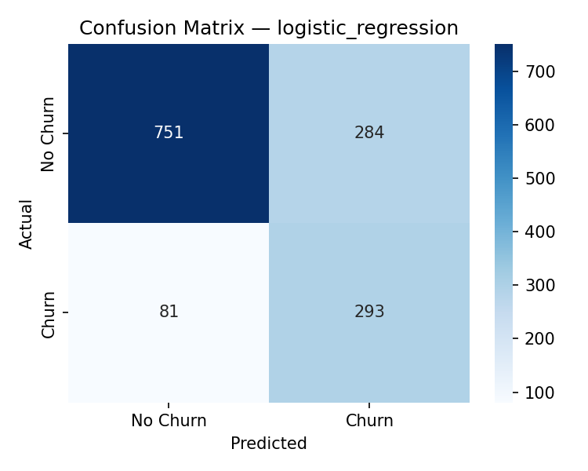
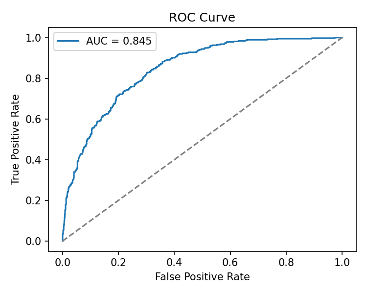
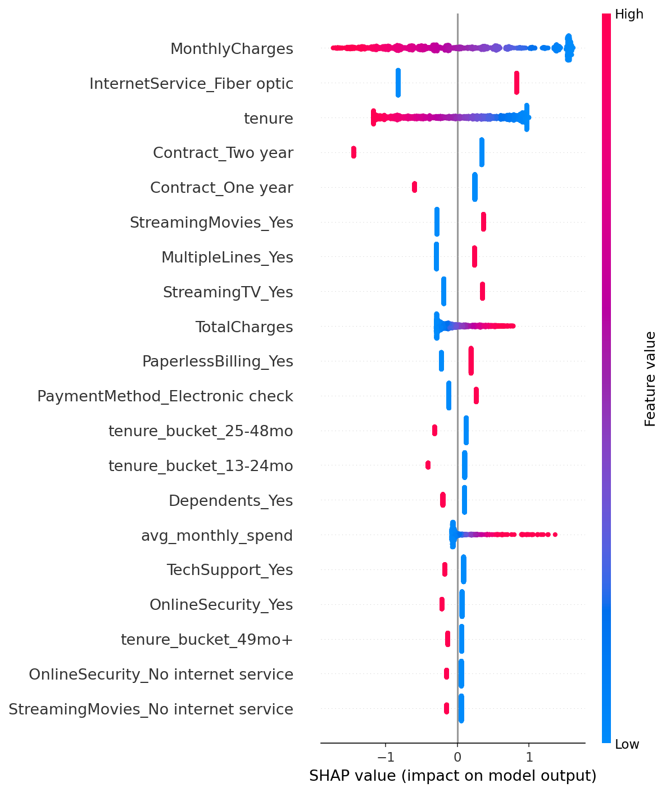

# Customer Churn Predictor

A churn prediction pipeline that goes beyond "train a model, report accuracy."
It answers the question a retention team actually asks: **which customers
should we call first, and how much revenue is on the line?**

## Why this isn't just another churn notebook

Most churn portfolio projects stop at EDA + a classifier + an accuracy score.
This one adds three things that are usually missing:

1. **SQL, not just pandas** — the cleaned data is loaded into SQLite and
   analyzed with real SQL (`sql/churn_queries.sql`), because production data
   usually lives in a database, not a CSV in your notebook folder.
2. **SHAP explainability** — instead of a single feature-importance bar
   chart, SHAP shows *how* each feature pushes an individual customer's
   prediction up or down, which is what you'd actually need to explain a
   flagged customer to a retention manager.
3. **A business-facing output, not just a metric** — `business_metrics.py`
   converts churn probability into a **Retention Priority Score** that
   ranks customers by revenue at risk, not just likelihood of leaving. A
   customer with 90% churn probability paying ₹200/month matters less than
   one at 70% paying ₹2,000/month.
4. **Dataset-agnostic by design** — every path and column name lives in
   `config.yaml`. Swapping in a different dataset later means editing one
   file, not rewriting the pipeline.

## Key findings (on the Telco Customer Churn dataset, 7,043 customers)

| Question | Finding |
|---|---|
| Overall churn rate | **26.5%** |
| Contract type impact | Month-to-month customers churn at **42.7%** vs **2.8%** for two-year contracts |
| Highest-risk cohort | New customers (0-6 months tenure) churn at **52.9%** |
| Revenue exposure | Fiber optic customers account for **$114,300/month** in at-risk revenue — the single largest segment |
| Payment friction | Electronic check users churn at **45.3%**, nearly 3x automatic payment methods |
| Business impact | The top 10% highest-priority customers (by the Retention Priority Score) hold **27% of total revenue at risk** — a retention team focusing there gets outsized ROI |

## Model performance

Three models were trained and compared (Logistic Regression, Random Forest,
XGBoost) with SMOTE to handle class imbalance, since accuracy alone is
misleading when only ~27% of customers churn.

| Model | Precision | Recall | F1 | ROC-AUC |
|---|---|---|---|---|
| **Logistic Regression** (selected) | 0.508 | 0.783 | **0.616** | 0.845 |
| Random Forest | 0.580 | 0.561 | 0.571 | 0.825 |
| XGBoost | 0.566 | 0.540 | 0.553 | 0.812 |

Logistic Regression was selected because **recall matters more than
precision here** — missing a customer who's about to churn costs more
(lost revenue) than a false alarm (a retention call that wasn't needed).





The SHAP plot confirms the SQL findings: **MonthlyCharges, tenure, and
contract type** drive predictions the most — high monthly charges combined
with short tenure and a month-to-month contract is the clearest churn
signal.

## Project structure

```
customer-churn-predictor/
├── config.yaml                    # single place to swap datasets / column names
├── data/
│   ├── raw/                       # original dataset
│   └── processed/                 # cleaned + feature-engineered data, SQLite db
├── sql/
│   └── churn_queries.sql          # business-question SQL queries
├── src/
│   ├── data_prep.py                # cleaning + schema validation
│   ├── features.py                 # feature engineering
│   ├── sql_loader.py                # loads cleaned data into SQLite
│   ├── train_model.py               # trains + compares 3 models with SMOTE
│   ├── evaluate.py                  # confusion matrix, ROC, SHAP plots
│   └── business_metrics.py          # Retention Priority Score
├── models/
│   └── churn_model.pkl             # best model + scaler, saved
├── reports/
│   ├── figures/                    # generated plots
│   └── retention_priority_list.csv # ranked customer list for retention outreach
├── requirements.txt
└── run_pipeline.sh                 # runs the entire pipeline end to end
```

## Running it

```bash
pip install -r requirements.txt
./run_pipeline.sh
```

This runs cleaning → feature engineering → SQL load → model training →
evaluation plots → business metrics, in order. Outputs land in `reports/`
and `models/`.

## Using your own dataset

This pipeline isn't hard-coded to the Telco dataset. To point it at a
different dataset:

1. Drop your CSV into `data/raw/`
2. Update `config.yaml`:
   ```yaml
   data:
     raw_path: "data/raw/your_dataset.csv"
     columns:
       customer_id: "your_id_column"
       target: "your_churn_column"
       revenue: "your_revenue_column"
       tenure: "your_tenure_column"
     target_positive_label: "Yes"   # or 1, or whatever marks a churned customer
   ```
3. Run `./run_pipeline.sh` again.

`data_prep.py` validates the schema up front and fails with a clear error
message if a required column is missing, instead of silently producing
wrong results.

## Dataset

[Telco Customer Churn (IBM Sample Dataset)](https://www.kaggle.com/datasets/blastchar/telco-customer-churn)
— 7,043 customers, 21 original features, fictional telecom company.

## Tech stack

Python · pandas · scikit-learn · XGBoost · SHAP · imbalanced-learn (SMOTE) ·
SQLite · matplotlib/seaborn

## Author

Built by Ashutosh — BSc Data Science student. Part of an ongoing portfolio
of applied ML projects with a focus on business-relevant outputs, not just
model metrics.
